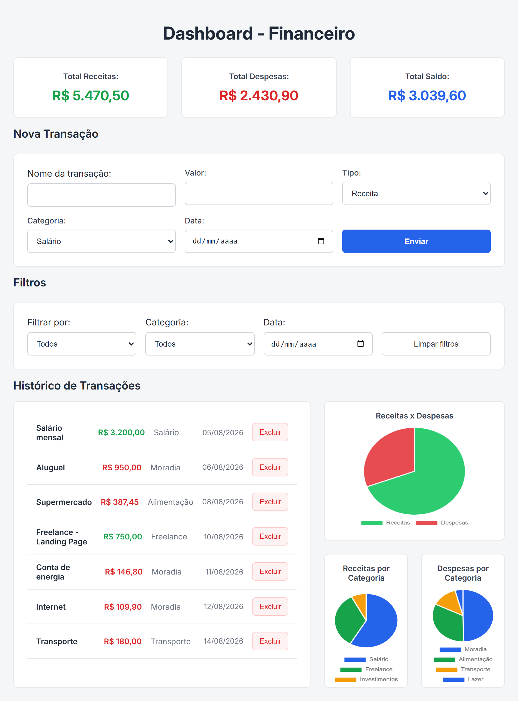
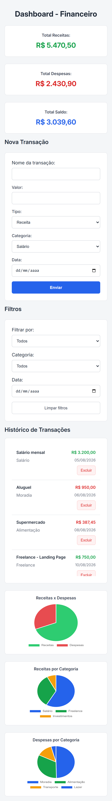

# Dashboard de Finanças Pessoais

Dashboard financeiro desenvolvido com JavaScript Vanilla para gerenciamento de receitas e despesas.

A aplicação permite cadastrar e excluir transações, acompanhar o saldo financeiro, filtrar movimentações por diferentes critérios e visualizar a distribuição das receitas e despesas através de gráficos.

O projeto foi desenvolvido com foco na prática dos fundamentos de JavaScript, manipulação do DOM, persistência de dados no navegador e construção de interfaces responsivas.

## Projeto online

Acesse o projeto publicado no GitHub Pages:

[🔗 Ver Dashboard Financeiro](https://italomartinsg.github.io/personal-finance-dashboard/)

## Preview



## Funcionalidades

- Cadastro de receitas e despesas
- Categorias dinâmicas de acordo com o tipo da transação
- Cálculo automático de receitas, despesas e saldo
- Histórico de transações
- Filtros por tipo, categoria e data
- Combinação de múltiplos filtros
- Limpeza dos filtros aplicados
- Exclusão de transações com confirmação em duas etapas
- Persistência dos dados utilizando LocalStorage
- Visualização gráfica de receitas e despesas
- Gráficos de distribuição por categoria
- Formatação de valores em Real (BRL)
- Validação dos dados do formulário com feedback ao usuário
- Layout responsivo para desktop, tablet e dispositivos móveis

## Tecnologias utilizadas

- **HTML5** — estrutura e semântica da aplicação
- **CSS3** — estilização, Grid, Flexbox e responsividade
- **JavaScript (ES6+)** — lógica, manipulação do DOM e gerenciamento das transações
- **Chart.js** — criação e atualização dos gráficos financeiros
- **LocalStorage** — persistência dos dados no navegador
- **Git e GitHub** — versionamento e controle do desenvolvimento

## Conceitos praticados

Durante o desenvolvimento deste projeto, pratiquei conceitos fundamentais de JavaScript e desenvolvimento Front-End, incluindo:

- Manipulação do DOM
- Eventos e delegação de eventos
- Arrays e objetos
- Métodos `forEach()`, `filter()`, `reduce()` e `findIndex()`
- `Object.keys()` e `Object.entries()`
- Manipulação de atributos `data-*`
- Persistência com `JSON.stringify()` e `JSON.parse()`
- Formatação monetária com `Intl.NumberFormat`
- Validação de formulários
- Filtros combinados
- Separação da lógica em funções
- Atualização dinâmica da interface a partir dos dados
- CSS Grid e Flexbox
- Media Queries e responsividade

## Responsividade

A interface foi desenvolvida para se adaptar a diferentes tamanhos de tela, reorganizando cards, formulários, histórico e gráficos para manter a aplicação utilizável também em dispositivos móveis.



## Como executar

Clone o repositório:

```bash
git clone https://github.com/italomartinsg/personal-finance-dashboard.git
```

Acesse a pasta do projeto e abra o arquivo `index.html` no navegador.

Não é necessário instalar dependências, pois o projeto utiliza JavaScript Vanilla e o Chart.js é carregado via CDN.

## Autor

Desenvolvido por **Ítalo Martins** como parte dos meus estudos e prática em desenvolvimento Front-End com JavaScript.

- GitHub: @italomartinsg
- LinkedIn: [Ítalo Martins](https://www.linkedin.com/in/italomartinsg/)
